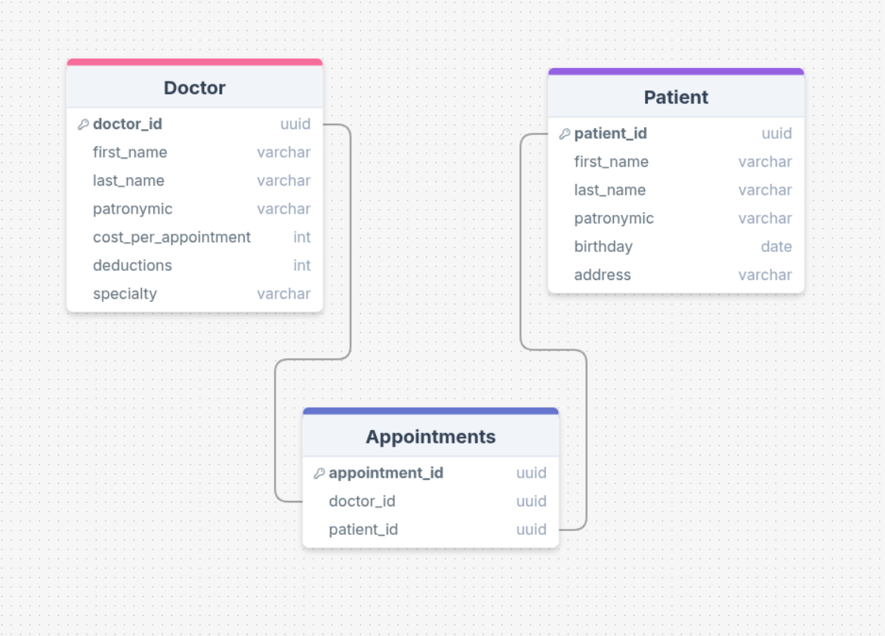

# Лабораторная работа 1
## 21. Платный прием в поликлинике

Платный прием пациентов проводится врачами разных специальностей
(хирург, терапевт, кардиолог, офтальмолог и т.д.). Информация о враче
(ФИО, специальность, сумма за прием, процент отчисления). Информация о
пациенте (фамилия, имя, отчество, дата рождения, адрес).
Накапливается информация о приемах, где хранится дата приема.
Пациент оплачивает за прием некоторую сумму, которая устанавливается
персонально для каждого врача. За каждый прием врачу отчисляется
фиксированный процент от стоимости приема. 

**Выходные документы:**
- Список квитанций об оплате приема определенного пациента за
определенный период времени в порядке убывания дат. В квитанции
указывается информация о стоимости приема.
- Ведомость на оплату врачей за определенный период. Размер
начисляемой врачу заработной платы за каждый прием вычисляется по
формуле:
 Зарплата = Стоимость приема · Процент отчисления на зарплату.
 Из этой суммы вычитается подоходный налог, составляющий 13% от
начисленной зарплаты.

**Er-Диаграмма**

